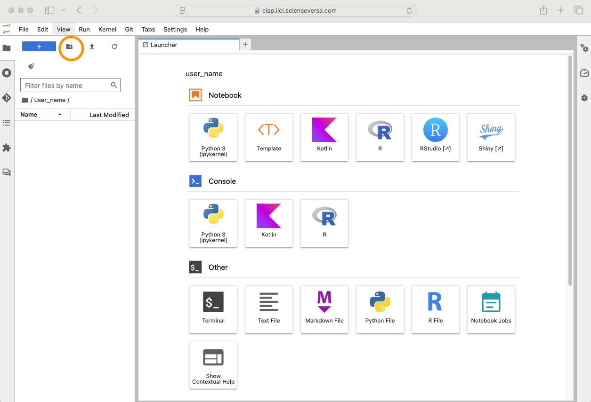
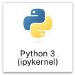
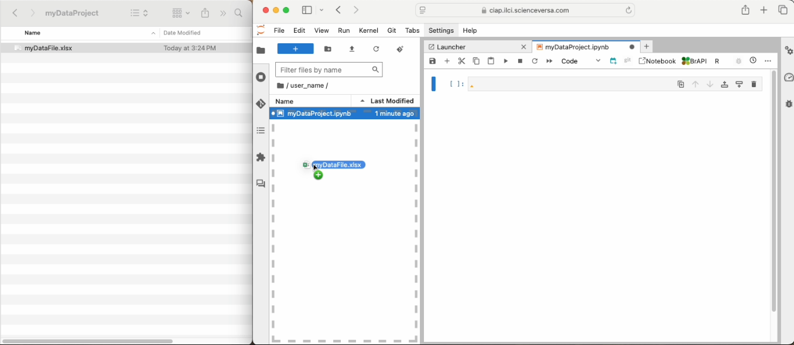

# Getting started 

This document will describe the basic steps and skills necessary to start using the ILCI Crop Improvement Analytical Platform, including:

1. Logging into the CIAP
2. Creating a directory system
3. Navigating the Launcher
4. Using computational notebooks
5. Importing data as flat files


## Logging into the CIAP


!!! note "To-do"
    * Link to Learning hub?
    * Contact email?
    * Match "login" buttons with design on home page.
    * Link to BrAPI helper tutorial

If logging in for the first time, navigate to the ILCI CIAP sign-in page: 

[CIAP Login](https://ciap.ilci.scienceversa.com){.md-button}

Use the email address you used to register. When logging in for the first time create a new password. This will be your password moving forwardß. 

If you are an ILCI researcher and need an account, please contact the CIAP support team: 

[Email CIAP :fontawesome-solid-paper-plane:](#){.md-button}


!!! warning
    Keep your account name and password secure and never share your account information. Computational resources can be used by hackers for malicious and for-profit purposes, which are prohibited by USAID. Please help keep this resource secure for ILCI research purposes. Software installation and useage is monitored.


## Creating a directory system

When you first login to the CIAP, you will see a directory system on the left-hand side and a Launcher on the right hand side of your screen.


/// caption
JupyterHub Launcher page in the CIAP at start-up.
///

Start by making a directory for yourself using your name as a label by selecting the add directory button :fontawesome-solid-folder-plus:. You can also right-click or ++ctrl++ click and select 'New Folder'. Moving forward always work within your named directory. By default this directory is private to you.

For organization and reproducibility set up a directory system within your named directory for every data project. Always include a README within each directory that describes the purpose of the directory and a description of the files found within the directory.

Example directory system:

```
user_name/
├── README.txt
├── project_1_title/
│   ├── raw_data/
│   ├── output/
│   ├── documents/
│   └── README.txt
└── project_2_title
    ├── raw_data/
    ├── output/
    ├── documents/
    └── README.txt
```


## Navigating the Launcher 

On the right-hand side of your screen is a JupyterHub Launcher. The Launcher provides quick links to features available to you within the platform. This includes Jupyter Notebooks preset to interpret R or Python languages. Simply click on the icon for the tool you would like to use.  


<div class="grid cards" markdown>

{align=center}
/// caption
Jupyter Notebook preset to interpret R
///

{align=center}
/// caption
Jupyter Notebook preset to interpret Python
///

</div>


We really like Jupyter Notebooks for documentation, but you can also spin up an R Studio session and use R scripts or R Markdown instead. You can also work directly in the terminal. This is useful to run well annotated, reproducible scripts.


<div class="grid cards" markdown>

{align=center}
/// caption
Use R scripts or R Markdown in RStudio
///

  
/// caption
Run scripts in the terminal
///

</div>


!!! tip
    Navigate to the Launcher anytime using the menu bar at the top of the screen. Click 'File' --> 'New Launcher'. You can also use the keyboard shortcut: ++ctrl+cmd+l++.

## Using computational notebooks  

Computational notebooks, such as Jupyter Notebooks, allow you to combine documentation, code, and results into one report. Code and results are recorded as the code is executed promoting reproducibility and communication of analysis, including how results were obtained.  

#### Create a new notebook
Navigate to your documents or similar directory. Create a notebook in the Launcher by selecting either the ‘R’ or ‘Python’ icon, as shown above. You can also create a notebook by right clicking in the directory window and selecting 'New Notebook' or by navigating to 'File' --> 'New' --> 'Notebook'.

#### Set a coding language
When creating a notebook from the Launcher the programming language is preset for you. Otherwise, once your notebook is open, you will need to navigate to the top right corner of the notebook to set the kernel, or interpreter, to R. Click on ‘Python 3 (ipykernel)’ and in the drop down menu and select ‘R’. 

#### Save and name your notebook
Save and name your notebook. You can do this via 'File' --> 'Save Notebook', or push the save button :fontawesome-solid-floppy-disk: on the top left hand corner of your notebook. You can rename by right clicking on the untitled notebook. Name your notebook something meaningful that will help you and others identify the analysis later. 

=== "Create a new notebook" 
    [![new notebook]][new notebook]

=== "Set a coding language"
    [![kernel]][kernel]

=== "Save and name your notebook"
    [![rename]][rename]

  [new notebook]: img/getting_started/new_nb.png
  [kernel]: img/getting_started/rKernel.png
  [rename]: img/getting_started/rename.png

#### Add new cells and start coding
Add new cells with the plus button :fontawesome-solid-plus: in the upper left hand corner of the notebook to add cells for additional documentation and code. Click on the 'play' button :fontawesome-solid-play: at the top of your notebook to execute your cell or use the keyboard shortcut ++command+enter++ or ++ctrl+enter++. 

=== "Empty cell"

    [![Empty cell]][Empty cell]

=== "Raw cell"

    [![Raw cell]][Raw cell]

=== "Markdown cell"

    [![Markdown cell]][Markdown cell]

=== "Code cell"

    [![Code cell]][Code cell]

  [Empty cell]: img/getting_started/emptyCell.png
  [Raw cell]: img/getting_started/rawCell.png
  [Markdown cell]: img/getting_started/markdownCell.png
  [Code cell]: img/getting_started/rCell.png


!!! tip
    Sometimes you need to re-start your notebook: your screen freezes, you made a mistake, you forgot to filter your data, you want to re-run your notebook to check for reproducibility, etc. On the top banner, select 'Kernel' and from the drop down chose the option that fits your needs. You can restart the kernel and clear all ouput to re-run your notebook. Text in the cells will be saved, but will need to be re-executed.

## Importing data as flat files

Data can be uploaded into your directory for analysis or to share with other users. From your local computer drag and drop the data file into your directory on the server. 

{ align=left }


!!! tip
    Data can also be retrieved from databases such as BMS and Gigwa using the CIAP 'BrAPI helper' tool. [See this tutorial](https://) for more on the retreiving data from BrAPI compliant databases.